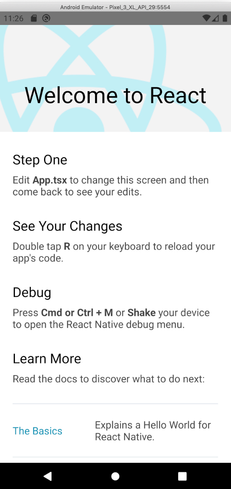
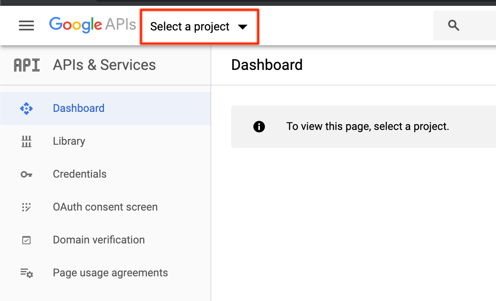
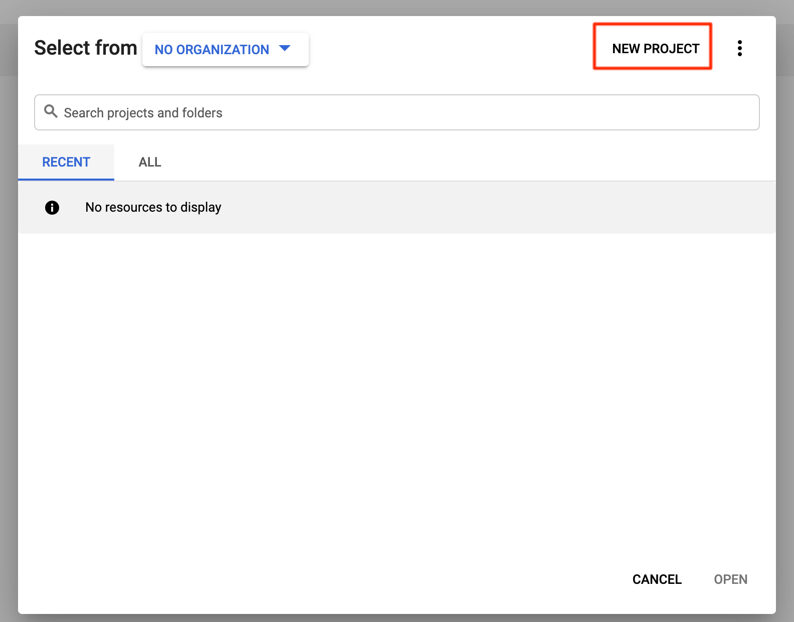
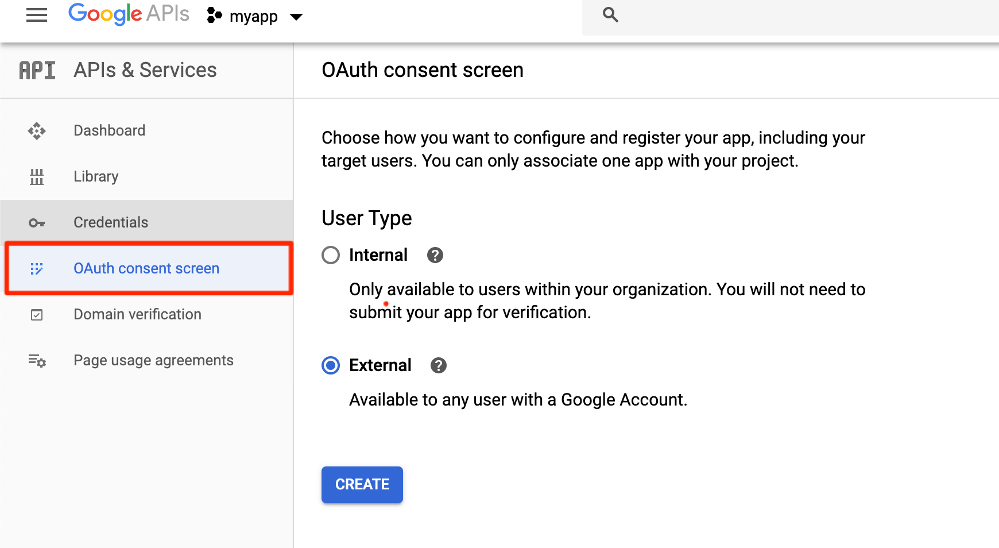
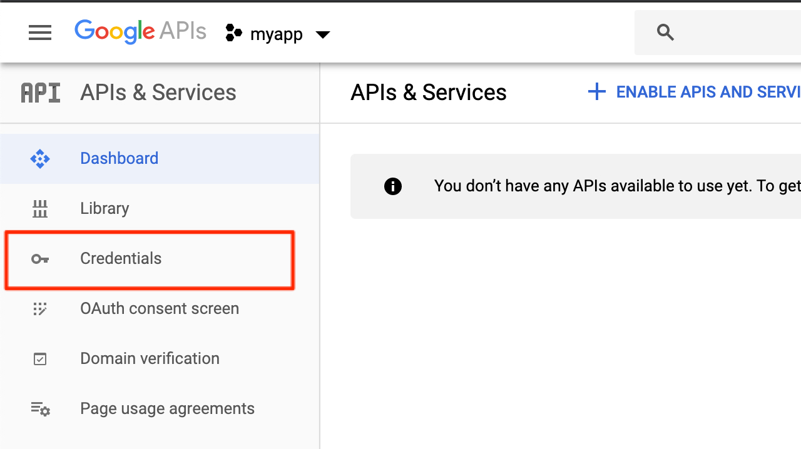
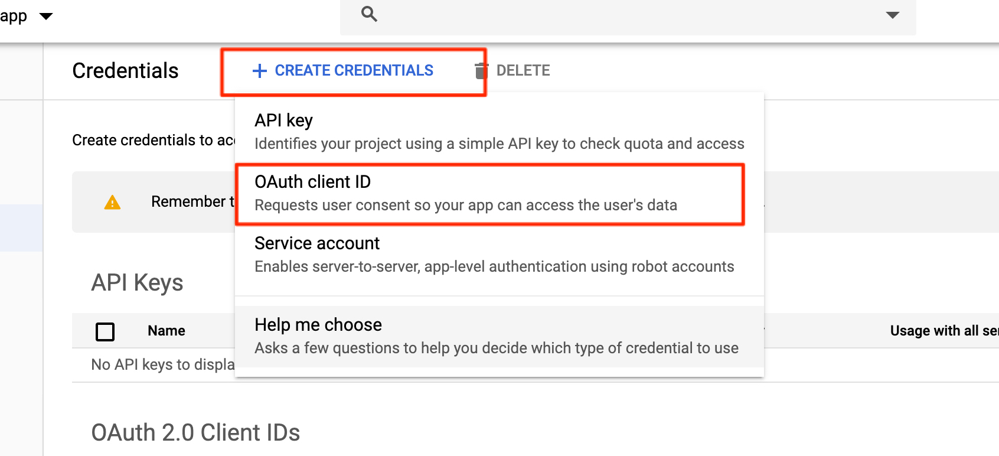

import Tip from "../../../src/components/Tip"

In this post, we'll create a React Native project, using [AWS Amplify](https://aws.amazon.com/amplify/) to allow our users to log in with their Google accounts.

Amplify helps you add things like authentication, APIs, databases, hosting, and much more to your project by doing the heavy lifting for you.

## Table of Contents

## Intro

This tutorial will explain how to use Amplify's Auth module with a Typescript React Native app. It'll cover both React Native CLI and Expo. If you're not familiar with TypeScript yet, you can read this post: <Link href="/from-zero-to-hero-with-react-and-type-script-lets-build-another-to-do-app"><Text as="a" href="From zero to hero with React and TypeScript: Let's build another to-do app!">From zero to hero with React and TypeScript: Let's build another to-do app!</Text></Link>

I'm writing this blog post because when I tried to implement Amplify Auth in my React Native app, I ran into some problems. Through this tutorial, I hope I can make it easier for both you and future me to get started!

For this tutorial, we'll be using [React Native CLI](https://reactnative.dev/docs/getting-started). I'll tell you when there's something specific to Expo or to React Native CLI.

## Creating a new React Native project

First, we'll scaffold a new React Native app. To do so, we'll use the official tutorial for React Native CLI Quickstart. I'm using a Mac and Android phone, but you can select whichever platforms apply to you.

1. Scaffold a new project with Expo or the React Native CLI: [https://reactnative.dev/docs/getting-started](https://reactnative.dev/docs/getting-started), either Expo or React Native CLI is fine. Expo is easier to get started with whilst React Native CLI offers more freedom (and support for native modules).
    - When running `expo init`, you can pick a TypeScript template. If you're using React Native CLI, you'll want to use the following command: `npx react-native init MyTSProject --template react-native-template-typescript`
2. You should now have a folder with the same name as you entered while scaffolding your app. From here on out we'll call it "myapp".
3. Start an emulator, Expo has tutorials for [IOS](https://docs.expo.io/versions/latest/workflow/ios-simulator/) and [Android](https://docs.expo.io/versions/v36.0.0/workflow/android-studio-emulator/).
4. Now, depending on the platform, either run `npm run android` or `npm run ios`.

You should now see something like this:



Let's add Amplify!

## Adding AWS Amplify

**Before following these steps, install Amplify first. To do that, you can follow these steps: [https://aws-amplify.github.io/docs/cli-toolchain/quickstart?sdk=js](https://aws-amplify.github.io/docs/cli-toolchain/quickstart?sdk=js)**

1. At the root of your project, run `amplify init`.
2. Specify the name of your project, the default is usually fine.
3. Specify a name for your environment, since this is your local development environment, enter "develop".
4. Pick your default editor, if it's not listed, pick "none".
5. Choose "javascript"
6. Choose "react-native"
7. For source, distribution paths, build command, and start command, you can use the defaults.
8. When asked if you want to use an AWS profile, choose "Y"
9. Either create a new one or choose any option on the list.

You should now be greeted by this message:

```
⠧ Initializing project in the cloud...

CREATE_IN_PROGRESS DeploymentBucket             AWS::S3::Bucket            Tue Mar 03 2020 11:45:13 GMT+0100 (Central European Standard Time) Resource creation Initiated
CREATE_IN_PROGRESS UnauthRole                   AWS::IAM::Role             Tue Mar 03 2020 11:45:13 GMT+0100 (Central European Standard Time) Resource creation Initiated
CREATE_IN_PROGRESS AuthRole                     AWS::IAM::Role             Tue Mar 03 2020 11:45:13 GMT+0100 (Central European Standard Time) Resource creation Initiated
CREATE_IN_PROGRESS AuthRole                     AWS::IAM::Role             Tue Mar 03 2020 11:45:12 GMT+0100 (Central European Standard Time)
CREATE_IN_PROGRESS UnauthRole                   AWS::IAM::Role             Tue Mar 03 2020 11:45:12 GMT+0100 (Central European Standard Time)
CREATE_IN_PROGRESS DeploymentBucket             AWS::S3::Bucket            Tue Mar 03 2020 11:45:12 GMT+0100 (Central European Standard Time)
CREATE_IN_PROGRESS amplify-myapp-develop-114507 AWS::CloudFormation::Stack Tue Mar 03 2020 11:45:09 GMT+0100 (Central European Standard Time) User Initiated
⠏ Initializing project in the cloud...

CREATE_COMPLETE UnauthRole AWS::IAM::Role Tue Mar 03 2020 11:45:27 GMT+0100 (Central European Standard Time)
CREATE_COMPLETE AuthRole   AWS::IAM::Role Tue Mar 03 2020 11:45:27 GMT+0100 (Central European Standard Time)
⠦ Initializing project in the cloud...

CREATE_COMPLETE DeploymentBucket AWS::S3::Bucket Tue Mar 03 2020 11:45:34 GMT+0100 (Central European Standard Time)
⠇ Initializing project in the cloud...

CREATE_COMPLETE amplify-myapp-develop-114507 AWS::CloudFormation::Stack Tue Mar 03 2020 11:45:36 GMT+0100 (Central European Standard Time)
✔ Successfully created initial AWS cloud resources for deployments.
✔ Initialized provider successfully.
Initialized your environment successfully.

Your project has been successfully initialized and connected to the cloud!

Some next steps:
"amplify status" will show you what you've added already and if it's locally configured or deployed
"amplify add <category>" will allow you to add features like user login or a backend API
"amplify push" will build all your local backend resources and provision it in the cloud
“amplify console” to open the Amplify Console and view your project status
"amplify publish" will build all your local backend and frontend resources (if you have hosting category added) and provision it in the cloud

Pro tip:
Try "amplify add api" to create a backend API and then "amplify publish" to deploy everything
```

You've successfully added AWS Amplify! 🚀️

## Adding Amplify Auth

1. In the root of your project, run `amplify auth`.
2. Choose "Default configuration with Social Provider (Federation)".
3. Choose "Username".
4. Choose "No, I am done.".
5. Pick any prefix, the default is fine.
6. For the redirect signin URI, enter `myapp://` where myapp is the name of your app.
7. One redirect signin URI is fine, enter N.
8. For redirect signout URI, also enter `myapp://`. Again, replace myapp the name of your app.
9. One redirect signout URI is fine, enter N.
10. Select the auth providers you'd like to support, you can move up/down with arrow keys and select options with your spacebar. When you're done choosing, hit "enter". For this tutorial we're going to pick "Google".
11. You'll notice AWS asking you for your Google OAuth credentials.

### Getting Google OAuth credentials

First, go to the Google API Developer Console: [https://console.developers.google.com/](https://console.developers.google.com/)

Select a project:

<div className="Image__Large">



</div>

Select an existing one or create a new one:



If you're creating a new one, enter your project information and click "create".

#### Creating an OAuth consent screen

Before Google allows you to create your OAuth credentials, you have to set up a consent screen first.

Head to the OAuth consent screen:



1. Choose the user type. For this tutorial, we'll use "External". Click "create".
2. Enter an application name, which is most likely the same as the other few times they asked 😉️.
3. Optionally, you can upload an application logo.
4. Leave the rest as-is and click Save.

#### Getting the credentials

Head to the credentials screen:



Create new OAuth credentials:



1. For application type, choose "Web application".
2. Enter a name e.g: "myapp, Amplify client".
3. Click "create".
4. Copy the client id and paste it into your terminal
5. Copy the client secret and paste it into your terminal
6. In your terminal, run `amplify push`
7. This might take a while. AWS is creating everything it needs to get your authentication running!
8. Take note of your hosted UI Endpoint, it'll look something like this: `https://myappbcfc15bf-bcfc15bf-develop.auth.eu-west-1.amazoncognito.com`, this is your Cognito endpoint URI, take note as you'll need it for the next steps!

The next step is letting Google know you trust your Amplify Cognito pool:

## Configuring your Google OAuth client to work with Amplify

The last step of configuring things is here!

Go to the edit screen of your OAuth client:


1. Add an authorized JavaScript origin with your Cognito endpoint URI from earlier, without the `/` at the end.
2. Add an authorized redirect URI, it's the same as your authorized JavaScript origin but with `/OAuth2/idpresponse` at the end.
3. Hit save.

That's it! Cognito is now configured and the only thing left to do is let users open the cognito login form.

## Creating a login screen

First, we'll need to install Amplify as NPM dependencies. To do so, run `npm i -S aws-amplify aws-amplify-react-native`. AWS has added types already.

In `App.tsx`, remove all the boilerplate of react-native and create a new App component. We'll render "Hello, please login." if the user has not been authenticated yet, if they are, we'll render "Hello, {name}".

```ts
import React, {FunctionComponent, useState} from 'react';
import {SafeAreaView, Text} from 'react-native';

interface User {
    name: string;
}

const App: FunctionComponent = () => {
  const [user, setUser] = useState<User|null >(null);

  return <SafeAreaView>
      <Text>Hello, {user?.name ?? "please login."}</Text>
  </SafeAreaView>;
};

export default App;
```

To configure Amplify:

Add

```ts
import Amplify from "aws-amplify"
import config from "./aws-exports"
```

to the top and right beneath your imports add

```ts
Amplify.configure(config);
```

That's it. Now let's create a login button:

```ts
import React, {FunctionComponent, useCallback, useState} from 'react';
import {Button, SafeAreaView, Text} from 'react-native';
import {Auth} from "aws-amplify"

interface User {
    name: string;
}

const App: FunctionComponent = () => {
    const [user, setUser] = useState<User | null>(null);

    const signin = useCallback(() => {
        Auth.federatedSignIn({provider: "google"});
    }, []);

    return <SafeAreaView>
        <>
            <Text>Hello, {user?.name ?? "please login."}</Text>

            {user === null && <Button title="Login with Google" onPress={signin} />}
            </>
    </SafeAreaView>;
};

export default App;
```

<Tip>

Using TypeScript? Then this might give you a type error:

```ts
Auth.federatedSignIn({provider: "Google"});
```

You can either choose to add `@ts-ignore`, or you can use

```ts
Auth.federatedSignIn({provider: CognitoHostedUIIdentityProvider.Google});
```

</Tip>

<Tip>

If you get this error:

`Unable to resolve module @react-native-community/netinfo`

1. Run `npm i -S @react-native-community/netinfo`.
2. Inside the IOS folder, run `pod install`
3. Rebuild & re-run the app

</Tip>

Your app should now look like this:


When you click on "LOGIN WITH GOOGLE" you'll see your web browser opening you'll be able to log in with your Google account. When you log in you'll notice a blank screen. Time for the next part!

## Adding an URI handler to your app

What happens is that after logging in, AWS redirects you to your redirect signin URI but your app isn't catching this URI yet! Let's fix that. After following any of these steps restart your app.

### Expo apps

Inside `app.json` add

```json
{
  "expo": {
    "scheme": "myapp"
  }
}
```

### React Native CLI apps

#### Android

First open `android/app/src/main/AndroidManifest.xml`, then add a new intent:

```xml
<manifest xmlns:android="http://schemas.android.com/apk/res/android"
          package="com.myapp">

    <uses-permission android:name="android.permission.INTERNET"/>

    <application
            android:name=".MainApplication"
            android:label="@string/app_name"
            android:icon="@mipmap/ic_launcher"
            android:roundIcon="@mipmap/ic_launcher_round"
            android:allowBackup="false"
            android:theme="@style/AppTheme">
        <activity
                android:name=".MainActivity"
                android:label="@string/app_name"
                android:configChanges="keyboard|keyboardHidden|orientation|screenSize"
                android:windowSoftInputMode="adjustResize">
            <intent-filter>
                <action android:name="android.intent.action.MAIN"/>
                <category android:name="android.intent.category.LAUNCHER"/>
            </intent-filter>
            <intent-filter android:label="filter_react_native"> <!-- THE NEW INTENT -->
                <action android:name="android.intent.action.VIEW"/>
                <category android:name="android.intent.category.DEFAULT"/>
                <category android:name="android.intent.category.BROWSABLE"/>
                <data android:scheme="myapp"/>
            </intent-filter>
        </activity>
        <activity android:name="com.facebook.react.devsupport.DevSettingsActivity"/>
    </application>

</manifest>
```

#### IOS

First open `ios/Inventory/Info.plist`, then add

```xml
<key>CFBundleURLTypes</key>
<array>
    <dict>
        <key>CFBundleURLSchemes</key>
        <array>
            <string>myApp</string>
        </array>
    </dict>
</array>
```

## Storing the authenticated user in your state

Now your app catches the redirect URI. After logging in you should now see the homescreen of your app again. Amplify allows you to retrieve the current user, let's do that and store the logged in user in our state so we can show either a greeting or a log in button.

In `App.tsx` add

```ts
useEffect(() => {
    Auth.currentAuthenticatedUser()
        .then(user => {
            user.getUserData((err?: Error, userData?: UserData) => {
               setUser({
                   email: userData?.UserAttributes.find(ud => ud.Name === "email")?.Value
               })
            });
        })
        .catch(error => {
            setUser(null);
        });
}, []);
```

Let's step through it

```ts
Auth.currentAuthenticatedUser()
```

Returns a promise with the currently signed in user. This user can already be logged in when opening the app. If there is no user, it rejects. Amplify persists the user automatically so they remain logged in.

```ts
user.getUserData((err?: Error, userData?: UserData) => {}
```

Retrieves the user's data. This data can be configured in your user pool. We then loop through all user data until we find an item containing the user's e-mail, which we then add to our state.

You should now see something like this:


That's it!

## Closing words

By now you've installed AWS Amplify in your react-native app and your users are able to log in. Now go ahead and create something awesome!

See a typo or something incorrect? Please contact me on Twitter or create a Pull Request! =)
